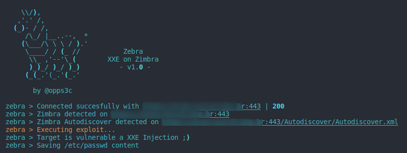

# 🦓 Zebra
> Zimbra < 8.8.11 XXE Injection Tool 



<br><br>

[](https://opensource.org/licenses/MIT)
[](https://github.com/oppsec/xcreen/issues)
[](https://twitter.com/oppsec)

<br>

## ⚡ Installing / Getting started

A quick guide of how to install and use Zebra.

```shell
1. Clone the repository with git clone https://github.com/oppsec/Zebra.git
2. Install the libraries with pip3 install -r requirements.txt
3. Execute Zebra with: python3 main.py -u https://example.com
```

<br><br>

### ⚙️ Pre-requisites
- [Python 3](https://www.python.org/downloads/) installed on your machine.
- Install the libraries with `pip3 install -r requirements.txt`

<br><br>

### ✨ Features
- Fast scan
- Low RAM and CPU usage

<br><br>

### 📚 To-Do
- [ ] Add SSRF module
- [ ] Increase Zimbra detection

<br><br>

### 🔨 Contributing

A quick guide of how to contribute with the project.

```shell
1. Create a fork from Juumla repository.
2. Download the project with git clone https://github.com/your/Zebra.git
3. cd Zebra/
4. Make your changes.
5. Commit and make a git push.
6. Open a pull request.
```

<br><br>

### ⚠️ Warning
- The developer is not responsible for any malicious use of this tool.